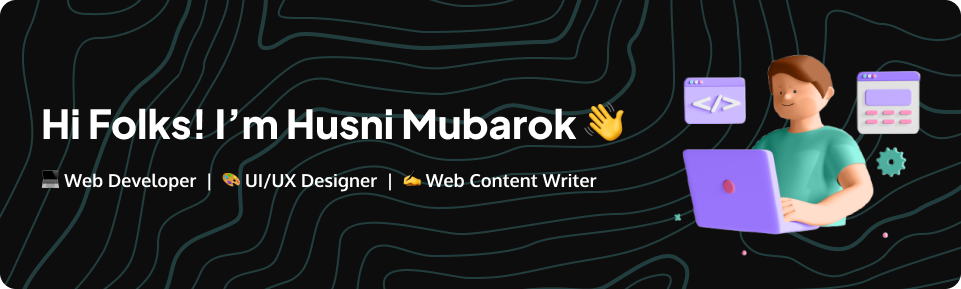

## 
---

### 👨‍🎓 About Me

I'm a 6th-semester Informatics student at **Universitas Internasional Semen Indonesia**, currently working as a **freelance Web Content Writer** at **Eyelink Group**.

Throughout my academic and freelance journey, I’ve worked on several **real-world Web Development and UI/UX projects**, ranging from client-based freelance work to university assignments. I'm deeply passionate about **technology**, especially in the areas of **programming** and **user interface/user experience design**.

> “Work with a calm mood and learn new things every day.”

---

### 🛠️ Tech Stack & Tools

💡 **Languages & Frameworks**  
     
   

💻 **Database & Tools**  
   

🎨 **Design & Productivity**  
 

---

<!-- ### 🔍 Highlights
- 🔥 Experienced in delivering **real-world freelance projects** focused on user needs and client satisfaction.
- ✍️ Skilled **content writer**, crafting technical, educational, and SEO-friendly web content.
- 🎓 Completed several academic-based web and mobile projects using **Laravel**, **React**, and **TailwindCSS**.
- 🌱 Currently deepening knowledge in **software engineering, backend development**, and **design systems**.

--- -->

<!-- ### 📂 Featured Projects

| Project | Tech Stack | Description |
|--------|------------|-------------|
| 🛒 [CreativeHub Platform](https://github.com/husnimubarok/creativehub) | Laravel, TailwindCSS, MySQL | A digital product marketplace platform for selling templates, fonts, and icon packs |
| ✅ [ToDo App Web](https://github.com/husnimubarok/todo-app) | Laravel, Svelte, TailwindCSS | A responsive and simple ToDo List application for daily task management |
| 👓 [Eyewear Landing Page](https://github.com/husnimubarok/eyewear-uiux) | Figma | A clean and responsive UI design for a modern eyewear brand landing page |

--- -->

### 📬 Connect With Me

